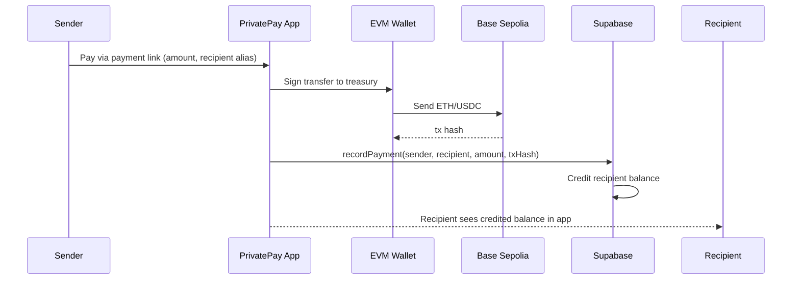
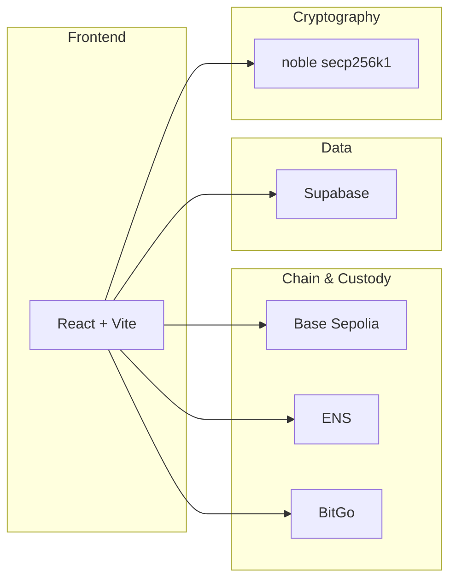
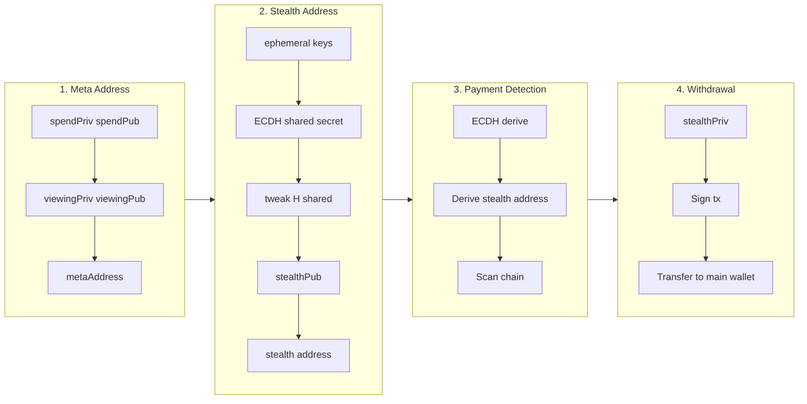
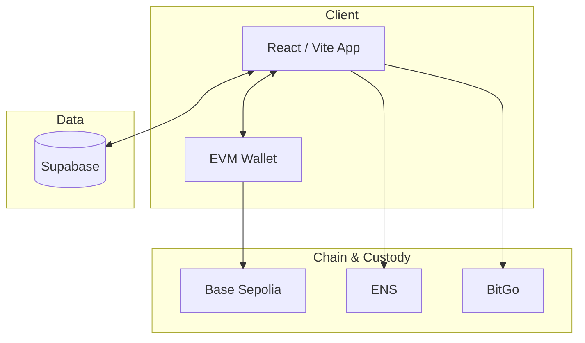
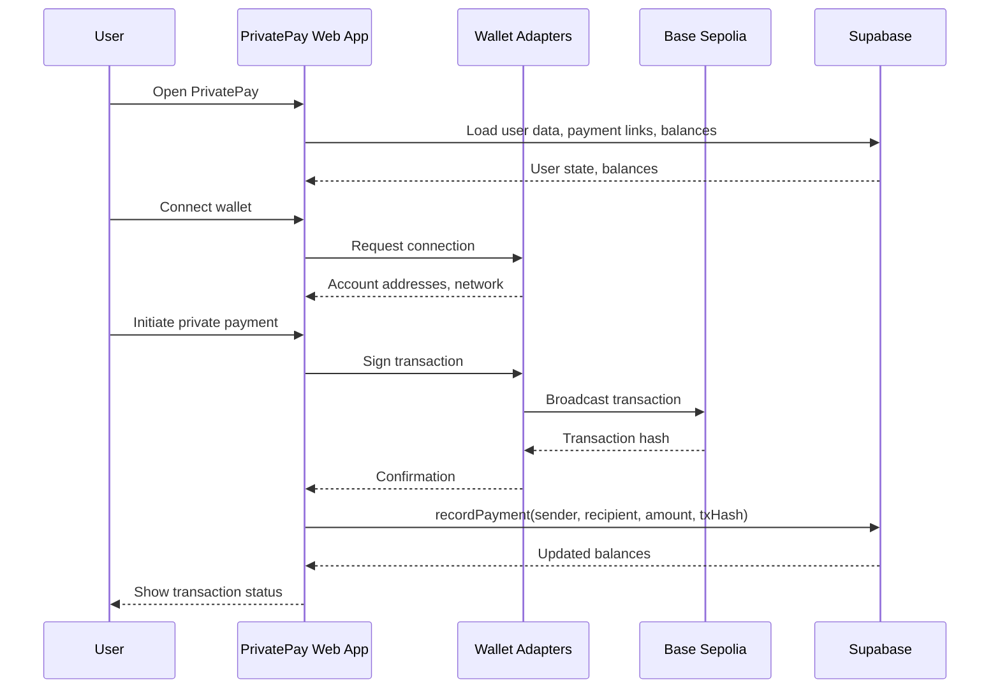
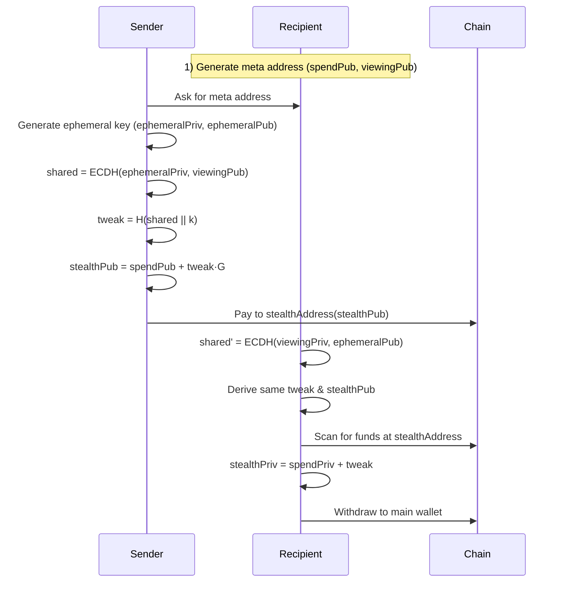

# PrivatePay 🐙

> The first untraceable, unidentifiable, private payments on blockchain.
Powered by Elliptic Curve Diffie-Hellman (ECDH) + secp256k1 + BIP 0352 / EIP 5564 + ROFL DarkPool Mixer

Simply means “Stealth Crypto Payments using multilayer forks”

| | Link |
|---|------|
| **Pitch deck** | [Private-Pay (Google Slides)](https://docs.google.com/presentation/d/1i_ZRVzjbjkXesqM678vyouuYk2o7o2z_gGqPZtqmkkE/edit?usp=sharing) |
| **GitHub** | [AmaanSayyad/Private-Pay-](https://github.com/AmaanSayyad/Private-Pay-) |
| **Live link** | 
| **Treasury (Base Sepolia)** | [`0x71197e7a1CA5A2cb2AD82432B924F69B1E3dB123`](https://sepolia.basescan.org/address/0x71197e7a1CA5A2cb2AD82432B924F69B1E3dB123) — [View on BaseScan](https://sepolia.basescan.org/address/0x71197e7a1CA5A2cb2AD82432B924F69B1E3dB123) |
| **Demo video** | Your demo link |

---

## 🚨 The Problem: Financial Privacy is Broken

### Real-Life Story

**Alice**, a legendary dev, won the ETHIndia Hackathon and received **$3,000** in prize money.

**Bob**, another participant who also won at the same hackathon, had a co-founder who wasn't trustworthy — the co-founder refused to admit receiving any prize money. Bob messaged all **3 winners** asking for the organizer's wallet address. 1/3 winner shared it. On the explorer, that single address made it trivial to see who received what. Bob quickly inferred that **$9,000** had been split among three people and, in a couple of minutes and with basic intelligence tools like Arkham, Dune Analytics, etc. linked **every wallet to its owner**.

**That's a serious concern.** Nobody wants the wallet that holds their real funds to be exposed. Bob — or anyone with the same info — could target those people for their own benefit.

### The Core Issues

❌ **Payments on public blockchains are NOT private**
- Traceable through tools like Arkham Intelligence
- Trackable via Dune Analytics and explorers
- Identifiable by anyone with basic skills

❌ **Results:**
- Fear of transacting
- Inconvenience for legitimate users
- Financial loss from targeted attacks
- Privacy violations for everyone

---

## ✅ The Solution: PrivatePay

**Where every transaction is fully private, anonymous, unidentifiable, and untrackable.**

### Core Benefits (current implementation)

- ✨ **Sender privacy**: Your wallet is never linked to the transaction
- ✨ **Receiver privacy**: Recipients' identities remain hidden
- ✨ **Observer blindness**: Third parties see nothing linkable
- ✨ **Simple UX**: Like Stripe links, but every transaction is a new, invisible wallet

### Key Features (current)

🔒 **Infinite Untraceable Stealth Accounts**
- Each payment generates a fresh stealth sub-account
- Unlimited transactions, unlimited mixers
- One single DarkPool

💼 **Static Payment Links**
- Share a single payment link (e.g., `amaan.privatepay.base`)
- Each access generates a unique stealth address
- No complex setup required

🔐 **Complete Unlinkability**
- Sender cannot identify receiver
- Receiver cannot identify sender
- Observers see nothing linkable

### Payment Link → Treasury Flow (Base)



Recipients can withdraw their credited balance to their wallet (Send & Withdraw on Base Sepolia). ENS Hub resolves `.eth` names (mainnet) and sends on Base; BitGo Shielded Hub for custody flows.

---

## 🔧 Technology Stack

### Privacy Infrastructure

**Currently in use (Base, ENS, BitGo):** Treasury-based flow — sender → treasury on-chain (Base Sepolia); recipient balance and withdrawals via Supabase + relayer. ENS for identity resolution; BitGo for shielded addresses and custody.

**Roadmap / in progress:**

```
🔐 Cryptographic Primitives (for future stealth flow)
├─ Secp256k1 elliptic curve cryptography
├─ SHA3-256 hashing for address derivation
└─ Secure random number generation

🤝 ECDH (Elliptic Curve Diffie-Hellman)
├─ Shared secret computation
├─ Key exchange protocol
└─ Perfect forward secrecy

🎭 Stealth Address Protocol (SSAP) — BIP 0352 / EIP 5564
├─ Unique address per transaction (target)
└─ Complete unlinkability

🌊 DarkPool Mixer (In Progress)
├─ Runtime Offchain Logic (ROFL) integration
├─ Homomorphic encryption
└─ Monero-style Ring Signatures & RingCT

🔍 Automated Monitoring
├─ Event-based transaction detection
├─ Event-based backup system
└─ Resilient recovery mechanism
```

### Built With



- **Blockchain**: Base (Base Sepolia) for payments; Ethereum mainnet for ENS resolution only
- **Frontend**: React + Vite + ConnectKit / wagmi
- **Database**: Supabase (PostgreSQL)
- **Custody**: BitGo (multi-sig, shielded addresses)
- **Cryptography**: @noble/secp256k1, @noble/hashes

### Ecosystem alignment

PrivatePay is built on and aligned with the following technologies and where they appear in the product:

| Technology | Role in PrivatePay |
|------------|--------------------|
| **Base** | Primary chain for private payments: treasury contract, ETH/USDC transfers, Send & Withdraw. All on-chain settlement runs on Base Sepolia. |
| **ENS (Ethereum Name Service)** | Identity layer: resolve `.eth` names on Ethereum mainnet; Send page ENS tab sends shielded ETH via ENS Treasury on Base. User ENS shown on dashboard. |
| **BitGo** | Custody and shielded vault: generate fresh shielded addresses, multi-sig (2-of-3), programmatic disbursement. BitGo Shielded Hub in-app; API routes proxy through serverless. |
| **Supabase** | Backend and state: user and wallet mapping, payment links, balances (ETH/USDC/BitGo), payment and withdrawal history, real-time balance updates. |
| **Vercel** | Hosting and serverless: frontend deploy, `/api` routes (withdraw, BitGo generate/balance/send). Use `vercel dev` for full API in development. |
| **ConnectKit / wagmi** | Wallet connection and EVM: Base Sepolia + Ethereum mainnet (ENS), chain switching, signer for treasury and ENS flows. |

The codebase uses these consistently: `config.js` and `.env` for Base/ENS/BitGo/Supabase; `src/lib/supabase.js` for all ledger and user data; `src/lib/bitgo.js` and `api/bitgo-*.js` for BitGo; Send page tabs (Send, Withdraw, ENS) and BitGo page for the respective flows.

---

## 📊 Market Opportunity

### Total Addressable Market (TAM)

| Market | Size | Growth |
|--------|------|--------|
| 💰 Global payment processing | $160B annually | - |
| 🪙 Crypto payment market | $624M | 16.6% CAGR |
| 🔒 Privacy-focused solutions | $1.2B | Growing |
| 👥 Crypto users worldwide | 590M+ | Expanding |

### Target Users

- **Individuals**: Privacy-conscious crypto users
- **Freelancers**: Receive payments without exposing income
- **Businesses**: Accept payments without revealing revenue
- **DAOs**: Anonymous treasury management
- **Hedge Funds**: Private money movements
- **High Net Worth**: Protection from targeted attacks

---

## 🎯 Competitive Landscape

### Why PrivatePay Wins


---

## ⚡ Future Roadmap

### Phase 1: Core Platform ✅
- ✅ Stealth address generation
- ✅ Payment link system
- ✅ Dashboard and monitoring

### Phase 2: Enhanced Privacy 🚧
- 🚧 Zero-knowledge proofs
- 🚧 Bulletproofs for amount hiding
- 🚧 Advanced DarkPool integration
- 🚧 ROFL-style monitoring

### Phase 3: Payment Expansion 🔮
- 🔮 Private credit and debit card payments
- 🔮 Disposable wallets

### Phase 4: Enterprise Features 🔮
- 🔮 Hedge fund money moves
- 🔮 API marketplace
- 🔮 White-label solutions
- 🔮 Compliance tools

### Endless Possibilities
- No more "James Waynn Exposer" incidents
- End to HyperLiquid wallet reveals
- Protection for high-value transactions
- Privacy for everyone, everywhere

---

### Cryptographic Flow



**Steps (summary):**

1. **Meta Address** — Generate spend key pair and viewing key pair; meta address = (spendPub, viewingPub).
2. **Stealth Address** — Ephemeral key → ECDH shared secret → tweak → stealth public key → stealth address.
3. **Payment Detection** — Recipient derives same stealth address via ECDH(viewingPriv, ephemeralPub), scans chain.
4. **Fund Withdrawal** — stealthPriv = spendPriv + tweak; sign and transfer to main wallet.

---

## 🧠 System Architecture Overview

Below is a concise, technical view of how the PrivatePay system is wired (Base Sepolia, ENS, BitGo, Supabase).

### Component Overview



### High-Level Architecture



At the center is the **React/Vite** app, which talks to your EVM wallet, Base Sepolia (and mainnet for ENS), BitGo, and Supabase.

### Stealth Meta-Address Flow (target architecture)

*This flow is the intended end-state for full on-chain privacy; the current app uses the treasury + ledger flow above.*



The app today uses the **Payment Link → Treasury Flow** (send to treasury, record in Supabase, withdraw from treasury). Wallet connection: `src/providers/ConnectKitProvider.jsx` — Base Sepolia + Ethereum mainnet (ENS) via wagmi/ConnectKit.

---

## 🚀 Getting Started (Developers)

### 1. Prerequisites

- **Node.js** ≥ 20.x (tested with Node 22.x)
- **npm** ≥ 10.x
- Browser wallet: **EVM wallet** (ConnectKit) on Base Sepolia

### 2. Install Dependencies

```bash
cd Private-Pay
npm install
```

### 3. Environment Variables (root `.env`)

Copy `.env.example` to `.env` and fill in your values:

```bash
cp .env.example .env
```

| Variable | Description |
|----------|-------------|
| **Supabase** | |
| `VITE_SUPABASE_URL` | Supabase project URL (Settings → API) |
| `VITE_SUPABASE_ANON_KEY` | Supabase anonymous key (public, safe for frontend) |
| **Base** | |
| `VITE_BASE_CHAIN_ID` | Base Sepolia chain ID (`84532`) |
| `VITE_BASE_RPC_URL` | Base Sepolia RPC (e.g. `https://sepolia.base.org`) |
| `VITE_BASE_MAINNET_RPC_URL` | Base mainnet RPC (optional) |
| `VITE_BASE_ASSET_SYMBOL` | Base asset symbol (e.g. `USDC`) |
| `VITE_BASE_ASSET_ADDRESS` | USDC contract address on Base Sepolia (optional) |
| `VITE_BASE_ASSET_DECIMALS` | USDC decimals (e.g. `6`) |
| **Ethereum (ENS)** | |
| `VITE_ETH_MAINNET_RPC_URL` | Ethereum mainnet RPC (for ENS resolution) |
| `VITE_ETH_SEPOLIA_RPC_URL` | Ethereum Sepolia RPC (optional) |
| `VITE_ENS_CHAIN` | ENS chain (e.g. `mainnet`) |
| **Treasury** | |
| `VITE_SHARED_TREASURY_ADDRESS` | Shared treasury (Base/ENS/BitGo) |
| `VITE_BASE_TREASURY_ADDRESS` | Base treasury (or same as shared) |
| `VITE_ENS_TREASURY_ADDRESS` | ENS treasury (or same as shared) |
| `VITE_BITGO_TREASURY_ADDRESS` | BitGo treasury (or same as shared) |
| **BitGo** | |
| `VITE_BITGO_API_URL` | BitGo API base (e.g. `https://app.bitgo-test.com/api/v2`) |
| `VITE_BITGO_ACCESS_TOKEN` | BitGo API access token |
| `VITE_BITGO_WALLET_ID` | BitGo wallet ID |
| `VITE_BITGO_COIN` | BitGo coin (e.g. `tbaseeth`) |
| `VITE_BITGO_ENV` | BitGo environment (e.g. `test`) |
| `VITE_BITGO_ASSET_SYMBOL` | Display symbol (e.g. `tBaseETH`) |
| **Secrets (do not commit)** | |
| `VITE_TREASURY_PRIVATE_KEY` | Relayer/withdraw key — **keep secret** |
| `TREASURY_PRIVATE_KEY` | Same key for backend/API — **keep secret** |

See [.env.example](.env.example) for the full template.

### 4. Run

```bash
npm run dev   # http://localhost:5173
```

**BitGo and API routes:** The `/api/*` routes (BitGo generate address, balance, send) are Vercel serverless functions. They are **not** served by `npm run dev` (Vite only serves the frontend), so the BitGo page will show "API route not found" unless you either:

- Run **`vercel dev`** so both the app and API run together, or  
- Run a separate API server and set **`VITE_BACKEND_URL`** in `.env` to that server (e.g. `http://localhost:3000`).

---

## 🧩 Project Structure (Key Folders)

```text
src/
  components/
    home/                # Dashboard cards, balance chart, payment links list
    shared/              # Navbar, MobileNav, icons, dialogs
    payment/             # Payment flow (pay via link)
    payment-links/      # Payment link list & entry
    alias/               # Alias detail, TxItem, AssetItem
    transactions/        # Transaction list (by wallet)
    dialogs/             # CreateLink, Qr, GetStarted, Onramp, etc.

  pages/
    IndexPage.jsx        # Landing / dashboard
    SendPage.jsx         # Send & withdraw (Base)
    EnsPage.jsx          # ENS Hub (resolve .eth, send on Base)
    BitGoPage.jsx        # BitGo Shielded Hub
    PaymentPage.jsx      # Pay via link (e.g. /pay/alias)
    PaymentLinksPage.jsx # Payment links listing
    TransactionsPage.jsx # Transaction history
    AliasDetailPage.jsx  # Alias balance & activity
    BasePage.jsx         # Base hub entry
    MainBalancePage.jsx  # Balance view
    (PointsPage.jsx)     # Points — feature disabled in-app

  layouts/
    RootLayout.jsx       # Root shell + outlet
    AuthLayout.jsx       # Auth-gated layout
    PaymentLayout.jsx    # Payment flow layout
    PlainLayout.jsx      # Minimal layout

  providers/
    RootProvider.jsx     # Composes all context providers
    ConnectKitProvider.jsx  # EVM wallet (Base + mainnet for ENS)
    UserProvider.jsx
    ChainProvider.jsx

  lib/
    supabase.js          # Payment links, balances, payments, withdrawals
    bitgo.js             # BitGo API (addresses, send)
    ethers.js            # Ethers helpers
  config.js              # Chains, treasury addresses, logos (src root)

  hooks/                 # useAppWallet, useEnsProfile, useActivityLog, etc.
  store/                 # Jotai: dialog-store, payment-card-store, balance-store
  utils/                 # style, formatting, pwa-utils, etc.

contracts/
  PrivatePayTreasury.sol # Treasury on Base Sepolia (Base, ENS, BitGo)
  README.md              # Contract deployment notes
```

---

## 🧪 Testing

- **Frontend**

  ```bash
  npm run test
  npm run test:e2e
  ```

See `docs/guides/` for setup and deployment.
